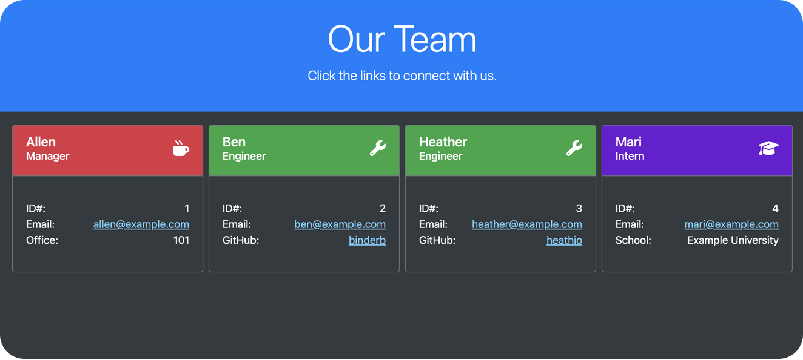

# Team Profile Generator

## Description

A simple Node.js command line tool that generates a self-contained, professional profile page for a software development team after gathering team details from the user. The team can consist of an arbitrary number of **managers**, **engineers**, and **interns**. The project includes the following features in accordance with the challenge guidelines:
- Proper setup of the `.gitignore` file to prevent `node_modules` and other extraneous system files from being tracked.
- Use of the **Inquirer** package to gather user input.
- Robust command line UX/UI to guide the user through the setup process.
- Use of **ES6 classes** and basic **object-oriented programming concepts** to organize team data.
- Use of the **Jest** package to implement unit tests for the implemented classes.
- Use of Node's `fs` module to read premade template HTML blocks and write the finished HTML file.

## Usage

Proper use of the tool requires **Node.js** and relies on the **Inquirer** package as an additional dependency. After cloning the repo, run `npm i` in the project root directory to install Inquirer and its dependencies. Then, to start using the tool, run

    node index.js

Follow the command line prompts to generate your team, and select `(done)` from the main menu when finished. The generated HTML page will be found in the **dist** directory after the program ends.

Check out the **index.html** file that is already included in the **dist** directory for an example of generated output.

🎥 A video walkthrough of the application can be viewed [here](https://drive.google.com/file/d/1AjZ6rPOEcBpVbnOYQ1P7Xe1s0V9dBJTX/view).

## Tests

Unit tests for the classes implemented in this project have been designed with the **Jest** package. After installing dependencies (`npm i`), execute

    npm run test 

to run all unit tests at once.

## Credits

Design mockup for the generated HTML page was provided by the UofM Coding Bootcamp (Trilogy Education Services); all code was written by the developer.

## License

Please refer to the LICENSE in the repo.
